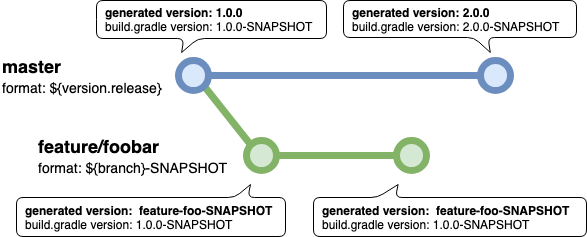

# Gradle Git Versioning Plugin

[](https://plugins.gradle.org/plugin/me.qoomon.git-versioning)

[](https://travis-ci.com/qoomon/gradle-git-versioning-plugin)

This extension will set project versions, based on current **Git branch** or **Git tag**.

* Get rid of...
    * editing `build.gradle`
    * managing version by git and within files
    * Git merge conflicts



## Install

### Add Plugin

add plugin to `buil.gradle` file

```groovy
plugins {
    id 'me.qoomon.git-versioning' version 'LATEST'
}
```

ℹ Consider [CI/CD](#cicd) section when running this plugin in a CI/CD environment 

## Configure Extension

You can configure the final version format for specific branches and tags separately.

**Example:** `build.gradle` 
```groovy
gitVersioning {
  branch {
    pattern = 'master'
    versionFormat = '${version}'
  }
  branch {
    pattern = 'feature/(?<feature>.+)'
    versionFormat = '${feature}-SNAPSHOT'
  }
  tag {
    pattern = 'v(?<tagVersion>[0-9].*)'
    versionFormat = '${tagVersion}'
  }
  commit {
    versionFormat = '${commit.short}'
  }
}
```

- `branch` specific version format definition.
    - `pattern` An arbitrary regex to match branch names (has to be a **full match pattern** e.g. `feature/.+` )
    - `versionFormat` An arbitrary string, see [Version Format & Placeholders](#version-format--placeholders)
    - ⚠ **considered if...**
        * HEAD attached to a branch `git checkout <BRANCH>`<br>
        * Or branch name is provided by environment variable or command line parameter

- `tag` specific version format definition.
    - `pattern` An arbitrary regex to match tag names (has to be a **full match pattern** e.g. `v[0-9].*` )
    - `versionFormat` An arbitrary string, see [Version Format & Placeholders](#version-format--placeholders)
    - ⚠ **considered if...**
        * HEAD is detached `git checkout <TAG>`<br>
        * Or tag name is provided by environment variable or command line parameter
  
- `commit` specific version format definition.
    - `versionFormat` An arbitrary string, see [Version Format & Placeholders](#version-format--placeholders)
    - ⚠ **considered if...**
        * HEAD is detached `git checkout <COMMIT>` and no matching version tag is pointing to HEAD<br>


#### Version Format & Placeholders

ℹ `/` characters within final version will be replaced by `-`**

- `${ref}`
    - current ref name (branch name, tag name or commit hash)

- `${branch}` (only available within branch configuration)
    - The branch name of `HEAD`
    - e.g. 'master', 'feature-next-big-thing', ...

- `${tag}` (only available within tag configuration)
    - The tag name that points at `HEAD`, if multiple tags point at `HEAD` latest version is selected
    - e.g. 'version/1.0.1', 'version-1.2.3', ...

- `${commit}`
    - The `HEAD` commit hash
    - e.g. '0fc20459a8eceb2c4abb9bf0af45a6e8af17b94b'

- `${commit.short}`
    - The short `HEAD` commit hash (7 characters)
    - e.g. '0fc2045'

- `Pattern Groups`
    - Contents of group in the regex pattern can be addressed by `group name` or `group index` e.g.
    - Named Group Example
        ```groovy
        pattern = 'feature/(?<feature>.+)'
        versionFormat = '${feature}-SNAPSHOT'    
        ```
    - Group Index Example
        ```groovy
        pattern = 'v([0-9].*)'
        versionFormat = '${1}'
        ```
        
- `${version}`
    - `version` set in `build.gradle
    - e.g. '1.2.3'
    
### Parameters & Environment Variables

- Provide **branch** or **tag** name
    - **Environment Variables**
        - `export VERSIONING_GIT_BRANCH=$PROVIDED_BRANCH_NAME`
        - `export VERSIONING_GIT_TAG=$PROVIDED_TAG_NAME`
    - **Command Line Parameters**
        - `gradle ... -Pgit.branch=$PROVIDED_BRANCH_NAME`
        - `gradle ... -Pgit.tag=$PROVIDED_TAG_NAME`
  
  ℹ Especially useful for **CI builds** see [Miscellaneous Hints](#miscellaneous-hints)

## Provided Project Properties

- `git.ref`
- `git.branch`
- `git.tag`
- `git.commit`
- `git.ref.<PATTERN_GROUP>`


## Miscellaneous Hints

### Command Line To Print Project Version
`gradle :version -q`

### CI/CD
Most CI/CD systems do checkouts in a detached HEAD state so no branch information is available, however they provide environment variables with this information. You can provide those, by using [Parameters & Environment Variables](#parameters--environment-variables). Below you'll find some setup example for common CI/CD systems.

#### GitLab CI Setup
execute this snippet before running your `gradle` command
```shell
before_script:
  - if [ -n "$CI_COMMIT_TAG" ]; then
       export GIT_VERSIONING_TAG=$CI_COMMIT_TAG;
    else
       export GIT_VERSIONING_BRANCH=$CI_COMMIT_REF_NAME;
    fi
```

#### Jenkins Setup
execute this snippet before running your `gradle` command
```shell
if [[ "$GIT_BRANCH" = origin/tags/* ]]; then e
    export GIT_VERSIONING_TAG=${GIT_BRANCH#origin/tags/};
else 
    export GIT_VERSIONING_BRANCH=${GIT_BRANCH#origin/};
fi
```

## Build
```shell
  - ./gradlew build
```
